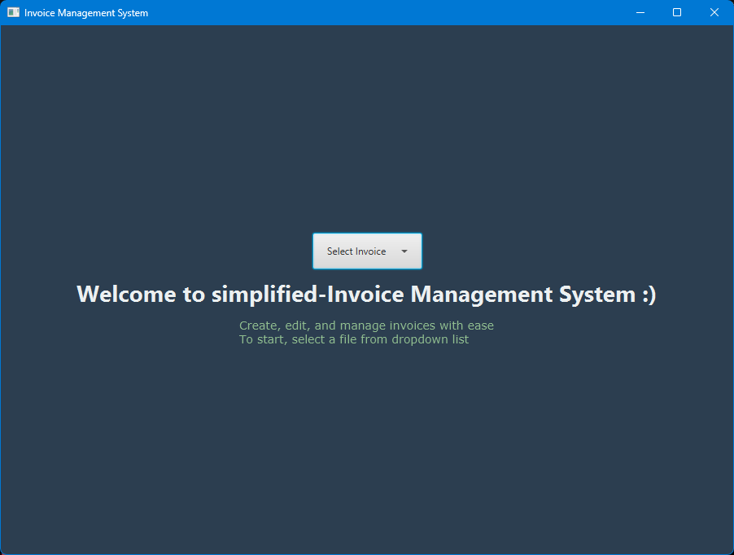
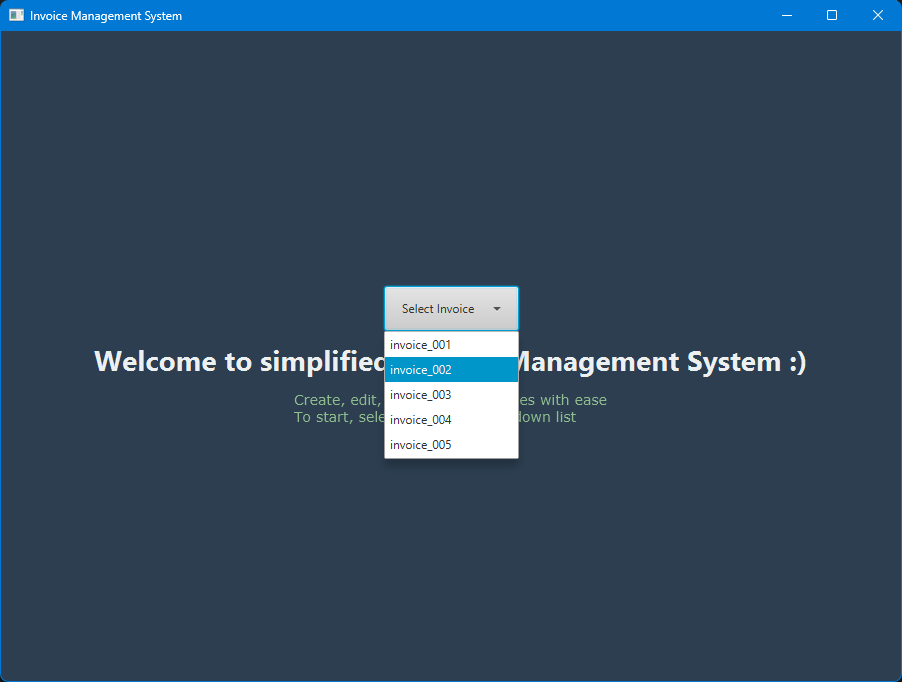
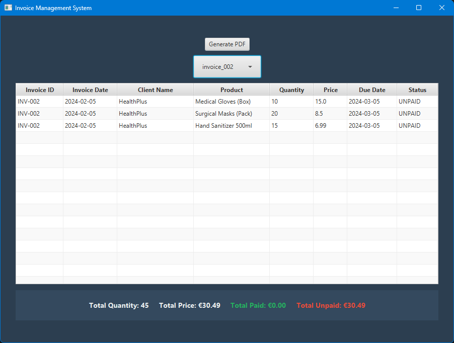
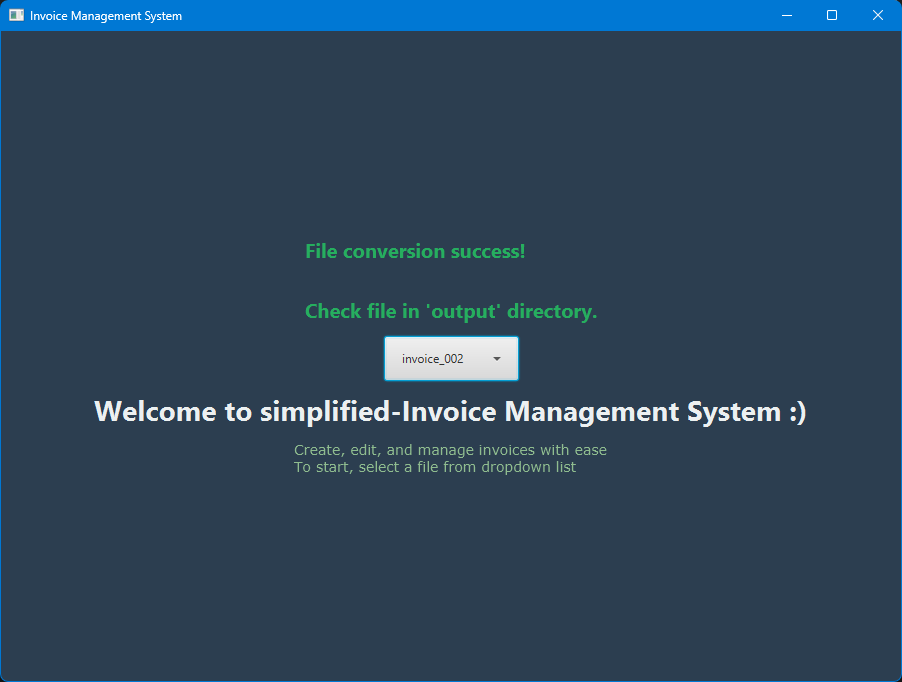
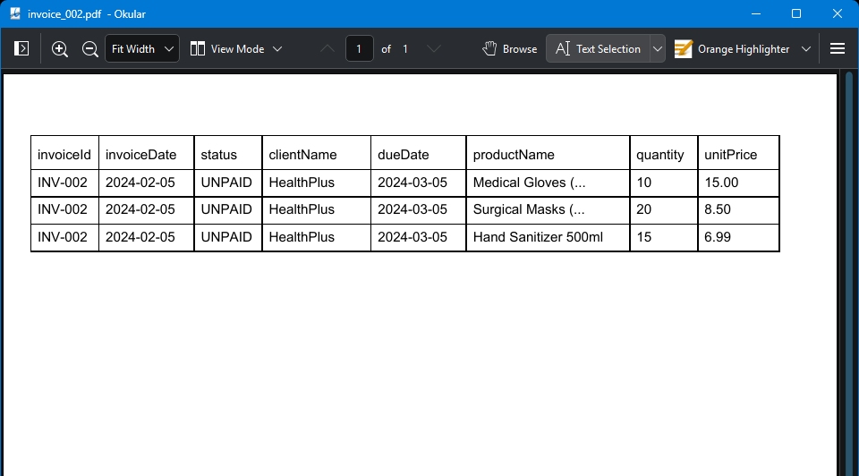

## Invoice Management System by Prakirth Govardhanam
- [Purpose](#purpose)
- [UI Screenshots](#ui-screenshots)
- [Class Structure and Description](#class-structure-and-description)
  - [Workflow](#workflow)
- [Evolution](#evolution)
- [Usage](#usage)
- [Self-Evaluation](#self-evaluation)
- [Future Developments](#future-developments)
- [Resources](#resources)
- [DISCLAIMER](#disclaimer)


## Purpose
This simplified Invoice Management System with local storage to manage invoices are specific for small scale 
businesses. The potential users are the businesses which cannot afford for complicated Invoice Management Systems 
with exhaustive layouts and expensive services. Minimalistic features and simplified UI of the system enables 
straight forward usage and enhanced usability. This lightweight Invoice Management System helps small businesses 
manage invoice data from local `.csv` files. Its core purpose is to simplify common invoice tasks such as loading 
records, viewing tabulated data, generating summaries, and exporting PDF reports) without requiring complex 
enterprise software or external cloud services.

The primary users are small business owners, freelancers, and student or early-stage teams that need a low-cost, 
easy-to-run desktop solution. It is also suitable for learners who want to understand a practical JavaFX and Maven 
workflow for file processing, UI interaction, and basic reporting.

## UI Screenshots
- Demo version of the UI with minimal features:
  - Home Page:
    

  - Read CSV files:
    
  
  - Tabulate CSV data:
    
    
  - Summary of Invoice file:
    
  
  - Conversion status to PDF from CSV:
     
  
  - Generated PDF file:
    
 

## Class Structure and Description
- `Document`, its subclasses (`Invoice`, `Receipt`, `CreditNote`) and `Product` are Data Models or the _Data Layer_
- `InvoiceManager`, `DashboardPane`, `ReportGenerator` and `CSVHandler` are the _Functional Layer_. 
- `InvoiceManager` (Application and Standalone class)
  - Key entry point for all the data models and functional layers and implementing the UI,
  - Manages UI elements, panes and supporting modules and methods required to build the UI,
  - Manages event listeners to dynamically manage the information displayed such as:
    - Trigger `CSVHandler` when invoice is selected from dropdown list of files. 
    - Update table summary when a new invoice is read from dropdown list of files.
- `Document` (Abstract Superclass, provides a fundamental structure for the subclasses to handle invoice data based 
  on the use-case of the invoice)
  - `Invoice` (subclass and key data model structure for the CSV file data)
  - `Receipt`, `CreditNote` (subclasses, for [future developments](#future-developments))
- `Dashboard` (Utility class, for building summary visuals based on summarized data from `Invoice` data model)
  - Partly implemented for generating brief paid and unpaid summary. 
  - However, due to buggy behavior moved it to [future developments](#future-developments))
- `CSVHandler` (Utility class, for conversion of string format data in CSV to specific data types appropriate for data 
  model class, `Invoice`)
- `ReportGenerator` (Utility class, for CSV file conversion to PDF using raw PDF syntax)
  - Modules and methods required for defining the format of PDF, defining column widths, drawing rows and tables, 
    writing text into the relevant columns.


### Workflow
```mermaidjs
  flowchart TD
    A[CSV file] <-->|CSVHandler reads and writes, to and from| B(Data Models)
    B <--> C[Functional Layer]
    C <--> |Updates| D[fa:fa-display UI] 
    D --> E[Invoice]
    D --> F[Dashboard]
```

## Evolution
- At the planning phase, which can be seen from [PLAN](./docs/PLAN.md), the features planned were extensively for 
  simplified usage and efficiency for small scale business owners. The features included tabulating data from `.dat` 
  files and performing basic manipulations (create, edit, update, delete) so that the business owners can keep track 
  of their clients and swiftly update or create new invoices whenever the need be.
- However, at the implementation phase, due to overhead from other course work, the system had to be implemented 
  with the bare minimum functionality. Hence, the plan was followed as it was but with a modification to the way 
  file formats to be handled from `.dat` to `.csv`. This introduced a new module, `CSVHandler`, to handle the 
  conversion of data from strings to specific data formats as needed in the data models.
- The implementation faced hiccups mostly at the stage of handling data from `.csv` files and converting them to the 
  required data types as specified in the data models. Tabulation of the data was a major challenge due to the lack 
  of understanding about the getter property that needed to be specified for the `PropertyValueFactory` to be set in 
  the data model methods for the data to be populated in the table cells. This lead to frustration but 
  resulted in major satisfaction since this constituted a huge leap in the UI in terms of the system functionality.
- Post the tabulation of `.csv` file data, summary row generation and PDF generation was smooth, since the 
  implementation was quite straight forward and required no modifications at the _Data Layer_ level.


## Usage
- The original source of truth to the entire system are the CSV files. Data from these files are processed, visualized and handled in the system using CSV file read operations.
- The application can be executed locally using IntelliJ IDEA editor for easy management.
- Here are the step-by-step instructions for using this project in a local development environment:

  1. Open the repository page on GitHub: `https://github.com/prak112/InvoiceManagementSystem`.
  2. Click **Code** \> copy the HTTPS URL.
  3. Open PowerShell on Windows and run: `git clone https://github.com/prak112/InvoiceManagementSystem.git`.
  4. Move into the project folder: `cd InvoiceManagementSystem`.
  5. Ensure prerequisites are installed:
     - `Java JDK` \(recommended: 17 or later\)
     - `Maven`
     - `Git`

  6. If you are using IDE other than IntelliJ IDEA:
     - Build the project with Maven: `mvn clean install`.
     - Use Maven run target if configured (example: `mvn javafx:run`).

  7. If you are using IntelliJ IDEA:
     - Open the folder as a Maven project and run the main class (`InvoiceManager`) using keyboard shortcut `Ctrl+F5` 
       or `Cmd+F5`

  8. UI opens the home page as shown in [UI screenshots](#ui-screenshots)
     - select and load invoice `.csv` files from the dropdown list which reads the sample files from the project 
       directory located at `src/main/resources`
     - Review the table/summary output, generated when a filename is selected from dropdown list
     - Click _GeneratePDF_ to generate a PDF which wil be saved in the `src/main/resources/output` directory.

## Self-Evaluation
- Positive aspects of the project include simplified-UI access and ease of usage with a clear overview of what went 
  where in terms of quantity and money. The data is stored locally on the user's system which provides 100% privacy 
  to the businesses progress and customer information.
- Negative aspects or challenges of the project include inability to include all the planned features to the 
  system which would have made it an efficient real-time usable system. Features such as creating, editing and 
  updating the invoice would have enhanced the functionality of the system. The possibility to visualize the data in 
  a pie or bar chart would be greatly beneficial for visual readers such as me. Hence, I have moved these features 
  to be implemented in the future.  

## Future Developments
- The project was developed in the most optimal way possible by focusing more on the functionality and shipping rather than being insistent on perfection and stubbornly following the plan without actually realizing the possibility of the usability of the system.  
- However, there is always room for improvement. The other features which could have been developed in addition to the 
  existing 
  functionality 
  are: 
  - Editable and updatable tables for managing invoices on the go.
  - Bar charts using JavaFX Charts to visualize monthly revenue by using `Dashboard` class to build the required graphs.
  - `Receipt` - generated when an invoice is marked paid, adds payment invoiceDate and method
  - `CreditNote` - represents a refund or adjustment on an invoice
  - Database storage of the invoice files so that the system could be scalable and more efficient for a small-scale business that is growing its customer base rapidly.
  - Enhanced Data Models to handle data from database by changing system architecture from local-first to offline-first with synchronized platform access by triggering server to frequently poll the local system and verify the status of data and log the polling event 


## Resources
* [Oracle Documentation](https://docs.oracle.com/javase/tutorial/uiswing/events/actionlistener.html)
* [JavaFX Charts tutorials](https://www.tutorialspoint.com/javafx/javafx_charts.htm) _for future implementations_
* [Event Handler examples](https://codingtechroom.com/question/javafx-single-eventhandler-multiple-events)
* GeeksForGeeks
* W3Schools

---

## DISCLAIMER
- AI (GitHub Copilot) was used for random data generation for invoice CSV files and building the library needed for 
  converting CSV to PDF through the module `ReportGenerator`
  - `ReportGenerator` sub class `PDFGenerator` has been AI-generated using GitHub Copilot Agent since this part of 
    the task required me to either import external libraries (OpenCSV or iText) or write a whole library to write a 
    PDF from scratch. 
  - My reasoning to use AI-generation was that I had to learn a completely new syntax within a week and this was beyond the scope of the project.   

- All invoice data are AI-generated. Any real-time references are purely coincidental and not intentional. 
---
